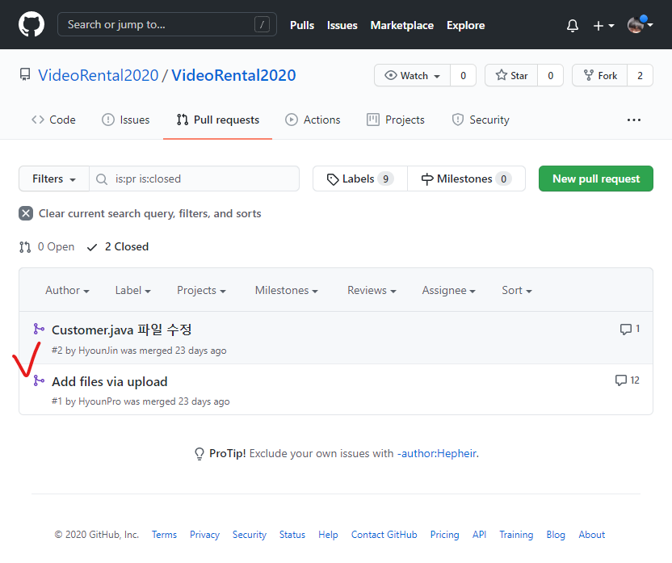

# 코드 리뷰

함께 GitHub에서 CodeReview 하는 방법에 대하여 알아보고, 간단한 코드리뷰를 작성함.

[#당일 작성한 코드리뷰가 있는 PR 보기](https://github.com/VideoRental2020/VideoRental2020/pull/1)

## How to 코드리뷰

Pull Request를 만든 뒤, 코드리뷰 하는 법은 다음과 같습니다.

### 1. Repository 들어가기

### 2. Pull Requests 탭에 들어가기

### 3. Code Review 할 Pull Request 선택하기

### 4. Files changed 탭 선택

### 5. 코드 리뷰하기

코드를 읽어보며 코멘트/수정제안을 남깁니다.

한 줄씩 리뷰를 할 수도 있고, 드래그하여 여러 줄을 한번에 리뷰할 수 있습니다.

하나의 파일 리뷰가 끝나면 우측 상단의 'Viewed'를 체크하고,
모든 파일의 리뷰가 끝났다면, Review chaanges를 누릅니다.

이 글은 코드 리뷰 후에 작성한거라, 이미 Merge 된 후여서 수정제안을 할 수 없지만,
Open 상태인 PR에서는 필요에 따라 댓글에서 수정 제안을 할 수 있습니다.
